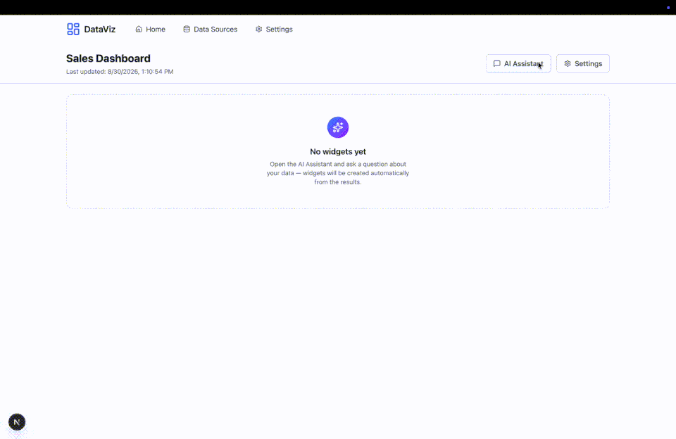
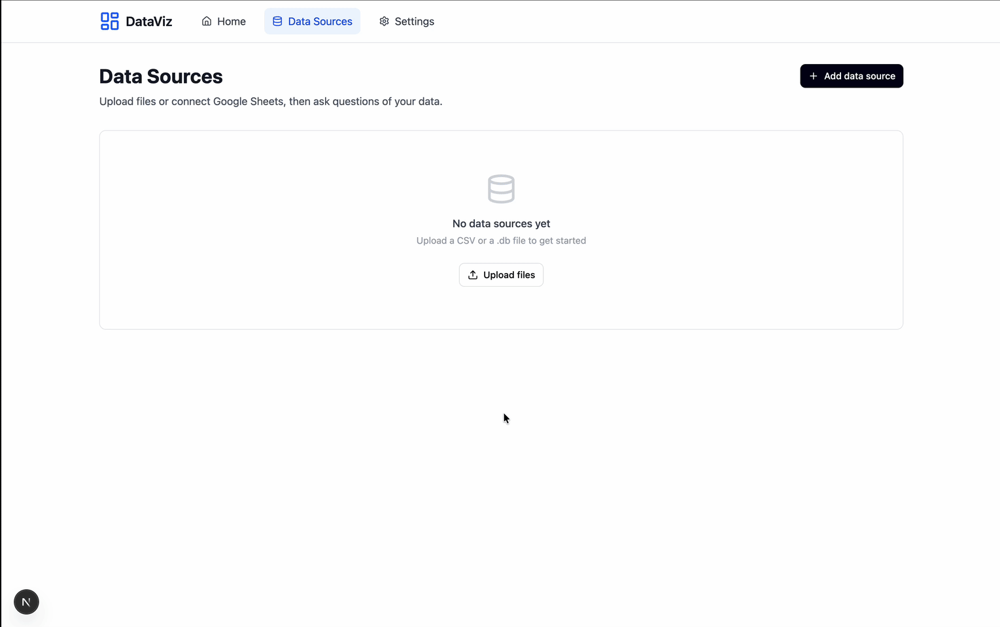
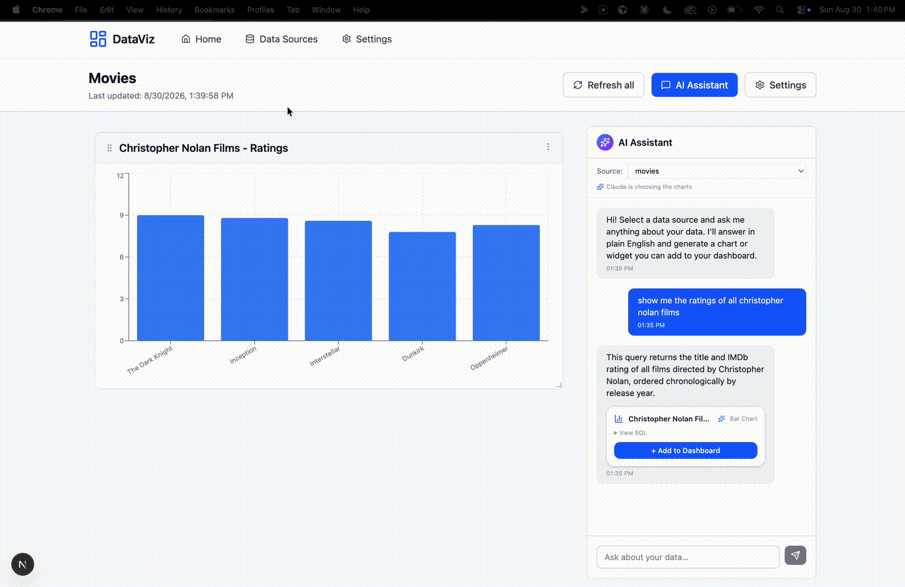

# DataViz

[](https://github.com/gitmanluke/dataviz/actions/workflows/ci.yml)

**Ask your data a question in plain English. Get a dashboard.**



DataViz is a local-first dashboard builder. Point it at a CSV, a SQLite file, or
a Google Sheet; ask a question in natural language; it writes the SQL, runs it
safely, and turns the answer into a chart you can arrange, edit, and refresh.
Your data and dashboards never leave your machine.

Built solo, end to end — the natural-language-to-SQL pipeline, the query-safety
layer, and the Google Sheets OAuth integration are all hand-built.

---

## Features

### Natural language → SQL → chart

Ask *"which channel drives the most revenue?"* and DataViz sends your data's
schema to Claude, which writes a single `SELECT`. Before it runs, a validation
layer checks it:

- a denylist of write keywords and filesystem functions, scanned after string
  literals and comments are stripped
- `better-sqlite3`'s prepared-statement parser rejects multi-statement input and
  unknown tables/columns
- `statement.reader` confirms it's read-only
- the query runs on a `{ readonly: true }` connection as defense in depth

If validation fails, the failure reason is fed back for one retry. A second
model then picks the widget type (bar / line / pie / stat / table) from your
phrasing, with a deterministic heuristic as the always-available fallback.

### Bring your own data



- **Files** — upload one or more `.csv` / `.db` files. Each becomes a table in a
  per-source SQLite database; add, replace, or drop tables later.
- **Google Sheets** — connect a spreadsheet through the Google Drive Picker.
  Each tab becomes a table. See [`docs/google-sheets.md`](docs/google-sheets.md).

### Refreshable widgets



Every widget remembers the query that built it. Hit **Refresh data** (or
**Refresh all**) to re-run it — no LLM call. A Google Sheet source can also
auto-refresh on a schedule (`manual` … `monthly`), enforced opportunistically on
app activity and gated by a Drive `modifiedTime` check, so a changed sheet
quietly updates the dashboards that depend on it.

### Editable, drag-and-drop dashboards

Arrange widgets on a grid. Every widget stores its raw rows plus an editable
spec (chart type, x-axis, series, sort), so you can retune the visualization
without asking again.

---

## How it works

```
ChatPanel ──▶ POST /api/ai/widget
                  │
                  ├─ sqlEngine.retrieve()      per-source SQLite → Claude writes
                  │                            SELECT → validate + 1 retry → run read-only
                  │
                  └─ resolveSpec()             ClaudeVizModel (Haiku) or detectSpec heuristic
                  │
                  ▼
             { spec, rows }  ──▶  widget: raw rows in `data`, WidgetSpec in `spec`
                                  WidgetCard renders applySpec(data, spec)
```

Two interfaces keep the seams clean:

- **`QueryEngine`** — how rows are fetched for a question. One implementation
  (`sqlEngine`) serves both source types; the route and viz agent don't care.
- **`VizModel`** — how a chart spec is chosen. `ClaudeVizModel` when an Anthropic
  key is set, `detectSpec` otherwise and on any failure (it never throws).

**Google Sheets** (`lib/integrations/google/*`): a Desktop-app OAuth 2.0
loopback flow with PKCE; the refresh token is stored AES-256-GCM-encrypted and
never leaves the server; access tokens are minted on demand and cached. The
Drive Picker is the one place a short-lived, read-only token reaches the browser.

---

## Tech stack

Next.js 16 (App Router, Turbopack) · React 19 · TypeScript (strict) ·
Tailwind CSS 4 · shadcn/ui · Prisma 6 + SQLite (app data) ·
better-sqlite3 (per-source user data) · recharts · react-grid-layout ·
Anthropic SDK · google-auth-library · Vitest

---

## Run it locally

Requires Node 22+ (`better-sqlite3` needs it).

```bash
git clone https://github.com/gitmanluke/dataviz.git
cd dataviz
npm install

cp .env.example .env
# generate a 32-byte key and paste it into DATA_SOURCE_ENCRYPTION_KEY in .env:
node -e "console.log(require('crypto').randomBytes(32).toString('base64'))"

npm run db:migrate
npm run dev
```

Open <http://localhost:3000>. Upload [`sample/sales.csv`](sample/sales.csv) and
[`sample/products.csv`](sample/products.csv) (a small B2B hardware dataset —
orders joinable to a product catalog) to try it out.

- **Natural-language queries** need an Anthropic API key — add one at
  `/settings` (there's a heuristic fallback without it).
- **Google Sheets** needs a Google Cloud OAuth client — see
  [`docs/google-sheets.md`](docs/google-sheets.md).

---

## Development

```bash
npm run test        # 82 Vitest unit tests
npm run typecheck   # tsc --noEmit
npm run lint        # eslint
npm run build       # production build
```

Tests cover the SQL validator, file/sheet ingestion, the no-LLM refresh path,
and the Google integration (token cache, spreadsheet parsing, sync scheduling).

### Benchmark

`npm run bench` runs the full question → widget pipeline against the sample data
and reports median / p95 latency and mean model cost per widget. It makes real
API calls, so it needs a key and is off by default:

```bash
ANTHROPIC_API_KEY=sk-ant-... npm run bench
```

Over 36 runs (12 questions × 3) against Claude Haiku 4.5, on the sample data:

| metric | value |
|---|---|
| latency, median | **2.5 s** |
| latency, p95 | 3.3 s |
| model tokens / widget | ~1,450 in · ~190 out |
| model cost | **~$0.0024 / widget** (≈ $2.40 per 1,000) |


---

## What's mine vs. off-the-shelf

**Built for this project:** the NL→SQL pipeline and its validator, the viz agent
and heuristic, the Google Sheets integration (OAuth, sync scheduler, Picker
wiring), the `QueryEngine` / `VizModel` architecture, the widget-spec system,
and every API route.

**Off-the-shelf:** shadcn/ui primitives (vendored under `components/ui/`),
recharts, react-grid-layout. `pydantic-ai/` is a standalone reference example,
not part of the app.

## License

MIT — see [`LICENSE`](LICENSE).
